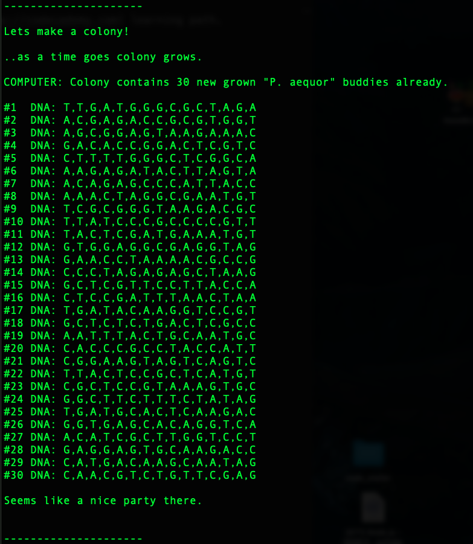
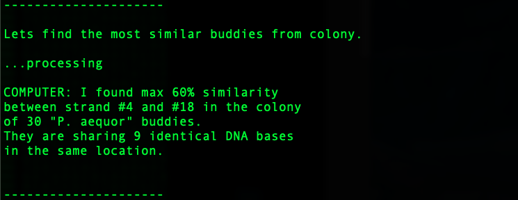

# Mysterious Organism
> Exercise made as JS challenge project<br/>
on [codecademy](https://codecademy.com) learning path.<br/>
Project focused on factory functions

## Usage
```
const { pAequorFactory } = require('./main.js');
```
---

### Parrameters
#### pAequorFactory(_specimenNum,dna_)

#### > _specimenNum_
Type: number<br/>
Default: 0<br/>

#### > _dna_
Type: array<br/>
Default: []<br/>

### Setters
---
* pAequorFactory.specimenNum()
* pAequorFactory.dna()

#### pAequorFactory.specimenNum(_num_)
#### > _num_
Type: number<br/>
Default: 0<br/>
Set the specimen numper.<br/>

---

#### pAequorFactory.dna(_dna_)
#### > _dna_
Type: array<br/>
Default: []<br/>
Set the specimen DNA sequence.<br/>

### Methods
---
* pAequorFactory.mutate()
* pAequorFactory.compareDNA()
* pAequorFactory.willLikelySurvive()
* pAequorFactory.complementStrand()
* pAequorFactory.compareColony()

#### pAequorFactory.mutate()

Mutate DNA sequence and set it as new dna.<br/>

---

#### pAequorFactory.compareDNA(_organism_)
#### > _organism_
Type: object<br/>

Compare dna sequence with "organism" dna.<br/>

---

#### pAequorFactory.willLikelySurvive()
Tests if organism has bigger chance to survive.<br/>

---

#### pAequorFactory.complementStrand()
Returns complement DNA sequence</br>

---

#### pAequorFactory.compareColony(_colony_)
#### > _colony_
Type: array<br/>

Compares all organism in colony and returns closest two</br>

---


## Testing
module testing preview 
"creation of organism colony - testing output"

"finding the most simillar DNAs - testing output"